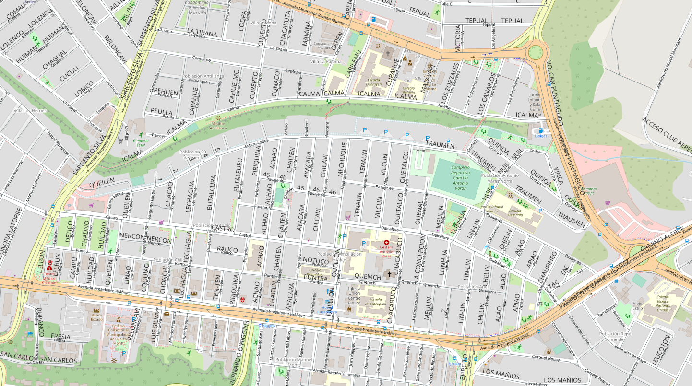

<aside>
<table align="right" style="padding: 1em">
<tr><td>Paquete <a target="_git" title="Enlace canónico a git para este paquete." href="http://git.digital-guard.org/preserv-CL/blob/main/data/LL/PuertoMontt/_pk0002.01"><big><b>pk0002.01</b></big></a> de <small><a target="_osmcodes" title="Jurisdicción" href="https://osm.codes/CL-LL-PuertoMontt">CL-LL-PuertoMontt</a></small>
</td></tr>
<tr><td>
Donante: <a rel="external" target="_doador" href="http://www.puertomonttchile.cl/">Puerto Montt</a><br/>
<small>rut:69220100-0</small> • Wikidata <a rel="external" target="_doador" title="Enlace del descriptor Wikidata del donante" href="https://www.wikidata.org/wiki/Q36214">Q36214</a></small><br/>

Obtido via <i>email;site</i> em <b>1900-01-01</b> por:<br/>
 Avaliação técnica: <a rel="external" target="_gitPerson" title="Usuario de Git" href="https://github.com/crebollobr">crebollobr</a><br/>
 Representação institucional: <a rel="external" target="_gitPerson" title="Usuario de" href="https://github.com/ThierryAJean">ThierryAJean</a><br/>
</td></tr>
<tr><td>Camadas: <a title="via" href="#-via"></a> </td></tr>
<tr><td><a href="http://git.digital-guard.org/preservCutGeo-CL2021/tree/main/data/LL/PuertoMontt/_pk0002.01">Datos publicados</a></td></tr>
</table>
</aside>

<section>

Este repositorio de metadatos describe un paquete de archivos donados al dominio público. Está siendo conservado por Digital Guard: para obtener más detalles, consulte la [documentación sobre el proceso de registro y conservación](https://git.digital-guard.org/preserv/tree/main/docs).

Nota. Este documento README fue generado por software a partir de la información contenida en el archivo [`make_conf.yaml`](make_conf.yaml) en este paquete, e información adicional de los catálogos de [donantes](https://git.digital-guard.org/preserv-BR/blob/main/data/donor.csv) y [paquetes](https://git.digital-guard.org/preserv-BR/blob/main/data/donatedPack.csv).

# Capas de datos

Los archivos contienen "capas de datos" temáticas. Los metadatos también describen cómo se evaluó cada capa y cómo se filtraron sus datos de forma estandarizada.

##  via

Nombre del archivo: `CALLES`.<br/>*Descarga* e integridad: [7c1cd5cd90518c829dae09cb6b94eaa67979a945e318e469e9d2a1126d037864.zip](http://dl.digital-guard.org/7c1cd5cd90518c829dae09cb6b94eaa67979a945e318e469e9d2a1126d037864.zip)<br/>Descripción: vias<br/>Formato: shp<br/>SRID: 3857

#### Datos relevantes
* `expresão com clase_com e nom_calle` (via_name)

#### Otros datos relevantes
* `comuna`
* `nom_comuna`
* `nom_calle`
* `clase_com`

#### Datos publicados
[http://git.digital-guard.org/preservCutGeo-CL2021/tree/main/data/LL/PuertoMontt/_pk0002.01/via](http://git.digital-guard.org/preservCutGeo-CL2021/tree/main/data/LL/PuertoMontt/_pk0002.01/via)<br/>3259520 bytes (3.11 <abbr title="mebibyte">MiB</abbr>)<br/>18510 segmentos con 2595.6 <abbr title="quilômetros">km</abbr><br/>densidad media: 1.94 segmentos/km²

# Evidencia de prueba


</section>
<section>

# Reproducibilidad

```bash

via:
rm -rf /tmp/sandbox/_pk15200000201_001 || true
mkdir -m 777 -p /tmp/sandbox
mkdir -m 777 -p /tmp/sandbox/_pk15200000201_001
mkdir -p /tmp/pg_io
wget -P /var/www/preserv.addressforall.org/download http://dl.digital-guard.org/7c1cd5cd90518c829dae09cb6b94eaa67979a945e318e469e9d2a1126d037864.zip
sudo chown postgres:www-data /var/www/preserv.addressforall.org/download/7c1cd5cd90518c829dae09cb6b94eaa67979a945e318e469e9d2a1126d037864.zip && sudo chmod 664 /var/www/preserv.addressforall.org/download/7c1cd5cd90518c829dae09cb6b94eaa67979a945e318e469e9d2a1126d037864.zip
psql $(pg_uri_db) -c "DROP  TABLE IF EXISTS pk15200000201101_p1_via CASCADE"
cd /tmp/sandbox/_pk15200000201_001; 7z  x -y /var/www/preserv.addressforall.org/download/7c1cd5cd90518c829dae09cb6b94eaa67979a945e318e469e9d2a1126d037864.zip "*CALLES*" ; chmod -R a+rwx . > /dev/null
psql postgres://postgres@localhost/ingest1 -c "SELECT srid, proj4text FROM spatial_ref_sys where srid=3857"
cd /tmp/sandbox/_pk15200000201_001; shp2pgsql -D   -s 3857 "CALLES.shp" pk15200000201101_p1_via | psql -q postgres://postgres@localhost/ingest1 2> /dev/null

psql postgres://postgres@localhost/ingest1 -c "CREATE VIEW vw1_pk15200000201101_p1_via AS SELECT gid, comuna, nom_comuna, nom_calle, clase_com, \
( CASE textregexeq(nom_calle,'^[[:digit:]]+(\.[[:digit:]]+)?$'') \
  WHEN TRUE THEN clase_com || ' ' || nom_calle \
  ELSE nom_calle \
END ) as via_name, \
geom FROM $(tabname)"
psql $(pg_uri_db) -c "SELECT ingest.any_load('shp2sql','$(sandbox)/CALLES.shp','via_full','vw1_pk15200000201101_p1_via','15200000201101','7c1cd5cd90518c829dae09cb6b94eaa67979a945e318e469e9d2a1126d037864.zip',array[]::text[],5,1)"
psql postgres://postgres@localhost/ingest1 -c "DROP VIEW vw1_pk15200000201101_p1_via"
@echo "Confira os resultados nas tabelas ingest.donated_packcomponent e ingest.feature_asis".
rm -f "/tmp/sandbox/_pk15200000201_001/*CALLES.*" || true
psql $(pg_uri_db) -c "DROP TABLE IF EXISTS pk15200000201101_p1_via CASCADE"
mkdir -m777 -p /var/gits/_dg/preservCutGeo-CL2021/data/LL/PuertoMontt/_pk0002.01/via
rm -rf /var/gits/_dg/preservCutGeo-CL2021/data/LL/PuertoMontt/_pk0002.01/via/*.geojson
psql $(pg_uri_db) -c "SELECT ingest.publicating_geojsons('via','CL-LL-PuertoMontt','/var/gits/_dg/preservCutGeo-CL2021/data/LL/PuertoMontt/_pk0002.01/via','1',9,3);"
cd /var/gits/_dg/preserv/src; sudo bash fixaPermissoes.sh /var/gits/_dg/preservCutGeo-CL2021/data/LL/PuertoMontt/_pk0002.01/via

```
</section>

