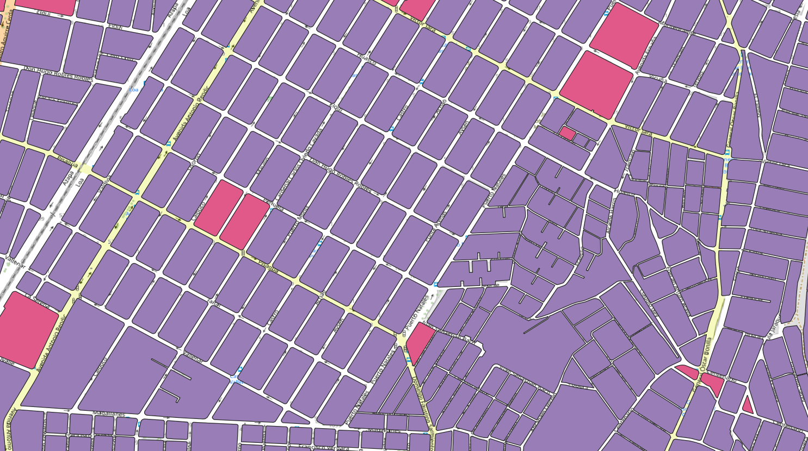

<aside>
<table align="right" style="padding: 1em">
<tr><td>Paquete <big><b>pk0004.01</b></big> de <small><a target="_afacodes" title="Jurisdicción" href="https://afa.codes/CL">CL</a></small>
</td></tr>
<tr><td>
Donante: <a rel="external" target="_doador" href="https://www.ine.gob.cl/">Instituto Nacional de Estatísticas do Chile</a>
 &nbsp; <small>RUT 60703000-6</small> • Wikidata <a rel="external" target="_doador" title="Enlace del descriptor Wikidata del donante" href="https://www.wikidata.org/wiki/Q3288549">Q3288549</a></small> 
Licencia <a rel="external" target="_doador" href="https://creativecommons.org/publicdomain/zero/1.0/"><b>CC0-1.0</b></a> (cc0 <a title="SHA256 0f53caf69606569e29f9160a65910d1755d45992969a3f2be4807a0ce4391b99.pdf" href="https://dl.digital-guard.org/0f53caf69606569e29f9160a65910d1755d45992969a3f2be4807a0ce4391b99.pdf"><code>0f53caf...pdf</code></a>) 
Obtido via <i>-</i> em <b>07/02/2024</b> por:
 &nbsp; Avaliação técnica: <a rel="external" target="_gitPerson" title="Usuario de Git" href="https://github.com/crebollobr">crebollobr</a>
 &nbsp; Representação institucional: <a rel="external" target="_gitPerson" title="Usuario de" href="https://github.com/ThierryAJean">ThierryAJean</a> 
</td></tr>
<tr><td>Camadas:  </td></tr>
<tr><td>Datos publicados en <a href="https://git.digital-guard.org/preservCutGeo-CL2021/tree/main/data/_pk0004.01">preservCutGeo-CL2021</a> <a href="#reproducibilidad">Reproducible</a></td></tr>
<tr><td>Visualización:  </td></tr>
</table>
</aside>

<section>

Este repositorio de metadatos describe un paquete de archivos donados al dominio público. Está siendo conservado por Digital Guard: para obtener más detalles, consulte la [documentación sobre el proceso de registro y conservación](https://wiki.addressforall.org/doc/Documentação_Digital-guard).

Nota. Este documento README fue generado por software a partir de la información contenida en el archivo [`make_conf.yaml`](https://git.digital-guard.org/preserv-CL/blob/main/data/_pk0004.01/make_conf.yaml) en este paquete, e información adicional de los catálogos de [donantes](https://git.digital-guard.org/preserv-BR/blob/main/data/donor.csv) y [paquetes](https://git.digital-guard.org/preserv-BR/blob/main/data/donatedPack.csv).

# Capas de datos

Los archivos contienen "capas de datos" temáticas. Los metadatos también describen cómo se evaluó cada capa y cómo se filtraron sus datos de forma estandarizada.

##  block

Nombre del archivo: `r` *Descarga* e integridad: [da15a5f04996f120bf719c6bf04777ae7212cdcd0d16beecb5770d890bf8d2a8.rar](https://dl.digital-guard.org/da15a5f04996f120bf719c6bf04777ae7212cdcd0d16beecb5770d890bf8d2a8.rar) Descripción: Quadras Formato: shp SRID: 4674

#### Otros datos relevantes
* `REGION`
* `NOM_REGION`
* `PROVINCIA`
* `NOM_PROVIN`
* `COMUNA`
* `NOM_COMUNA`

#### Filtrado de resultados y su publicación
197829427 bytes (188.66 <abbr title="mebibyte">MiB</abbr>) 167680 polígonos con 3647.95 <abbr title="quilômetros quadrados">km²</abbr> densidad media: 0.28 polígonos/km² GeoJSONs publicados em [https://git.digital-guard.org/preservCutGeo-CL2021/tree/main/data/_pk0004.01/block](https://git.digital-guard.org/preservCutGeo-CL2021/tree/main/data/_pk0004.01/block)

#### Visualización
[https://viz.addressforall.org/CL/_pk0004.01/block](https://viz.addressforall.org/CL/_pk0004.01/block)

# Evidencia de prueba

</section>
<section>

# Reproducibilidad

Consulte los detalles en [reproducibility.sh](https://git.digital-guard.org/preserv-CL/blob/main/data/_pk0004.01/reproducibility.sh).

</section>

